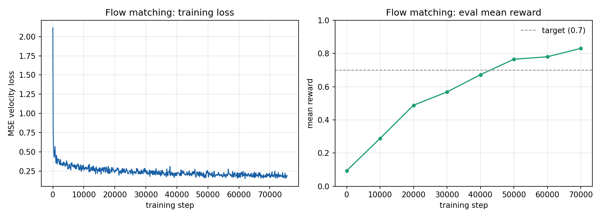
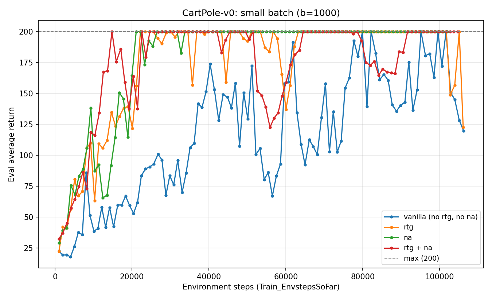
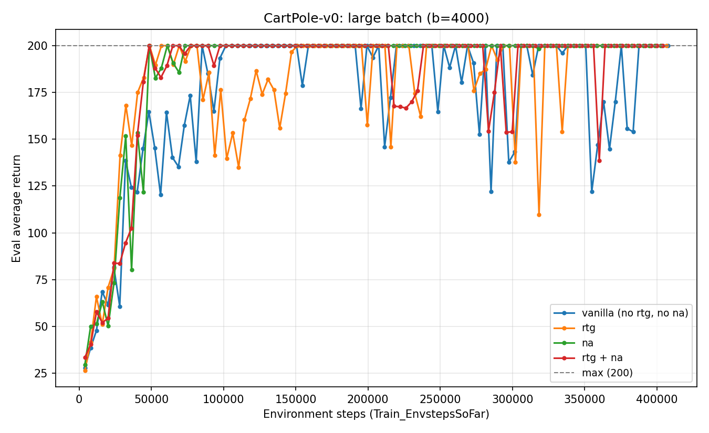
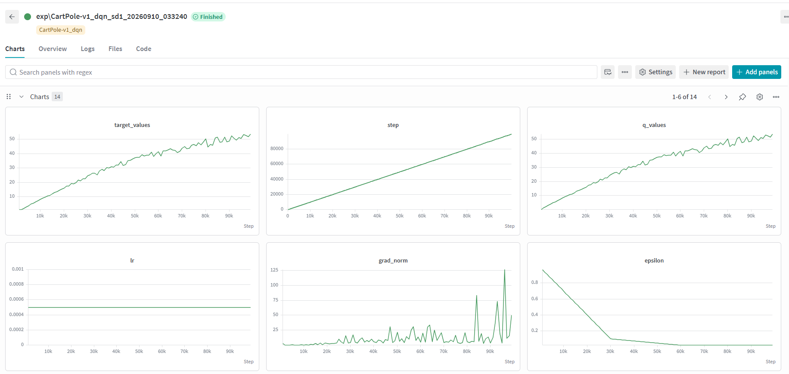
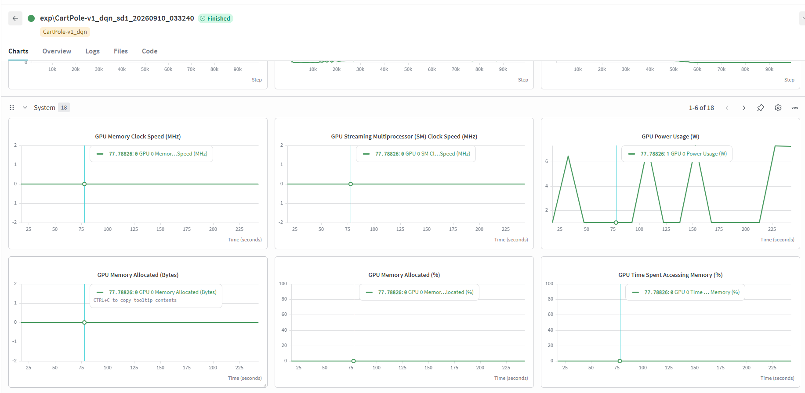

# UC Berkeley CS 285/185 — Deep Reinforcement Learning
### Coursework Portfolio Summary (Winter 2026)

This is my work for CS 285/185, Deep Reinforcement Learning. This is my first time studying RL seriously, and I come from a different background (not originally a CS/ML major), so I am learning a lot of this from scratch — reading the course's slide and Youtube video, writing the additional code for baseline code, and debugging a lot of things I did not expect.

I am putting this repo together to show what I have learned and what I can build. Some homeworks are fully done and trained, some are still in progress. I tried to be honest below about which is which, instead of making everything sound finished.

## Status overview

| # | Assignment | Core algorithms | Status |
|---|---|---|---|
| HW1 | Imitation Learning | Behavior Cloning (MSE) vs. Flow-Matching policy | ✅ **Implemented & trained** — results below |
| HW2 | Policy Gradients | REINFORCE, reward-to-go, learned baseline, GAE(λ) | ✅ **Implemented & trained** — results below |
| HW3 | Q-Learning & Actor-Critic | DQN / Double-DQN, Soft Actor-Critic (SAC) | 🔶 **DQN verified on CartPole**; SAC and remaining ablations in progress |
| HW4 | LLM RL Post-Training | REINFORCE (KL-regularized), GRPO (PPO-clip) | 🔶 Implemented; methodology below |
| HW5 | Offline RL | IQL, SAC+BC, FQL (flow-matching) | 🔶 Implemented; methodology below |

**Legend:** *Implemented* = algorithm coded and unit/integration-tested by hand. *Trained* = full run completed on the target benchmark with reported results below.

---

## HW1 — Imitation Learning ✅

The task here is PushT — a robot arm has to push a T-shaped block into a target position, learning only from demonstration data (no reward signal, just imitation).

I built two different policies to compare:

- **MSE policy** — a 3-layer MLP (256-256-256, ReLU) maps the 5-d state directly to a flattened 8-step action chunk, trained with mean-squared-error regression against the expert chunk.
- **Flow-matching policy** — a conditional flow-matching model (linear interpolation path `x_τ = τ·action + (1-τ)·noise`, regressed against the constant target velocity `action - noise`) conditioned on state + noisy action chunk + flow-time τ; actions are sampled via 10-step Euler integration of the learned velocity field.

Both use action chunking (chunk size 8, open-loop execution), AdamW (lr 3e-4, fixed — no LR decay), batch size 128, and gradient clipping at 1.0.

**Results** (mean evaluation reward, target ≥ 0.7):

| Policy | Best mean reward | Step reached |
|---|---|---|
| MSE (behavior cloning) | 0.709 | — |
| **Flow matching** | **0.831** | 70,000 |

*Flow-matching policy on PushT — training loss (left) steadily decreases and eval mean reward (right) climbs past the 0.7 target by ~step 40k, reaching 0.83 by step 70k.*

**Takeaway:** the flow-matching policy clears the target comfortably and clearly outperforms direct MSE regression. The PushT demonstrations are multimodal (several valid ways to approach and push the block); the MSE policy collapses these modes to their average, producing a hesitant, often off-centre push, while the flow-matching policy samples a single coherent mode per chunk, yielding smoother, more decisive trajectories and higher task coverage.

**Debugging notes worth flagging:** applying an EMA of the weights at evaluation time silently broke the flow policy (reward stuck near 0.18), since averaging the parameters of a velocity field does not yield a valid flow — evaluating the live training weights fixed it. Also switched from a cosine-decay LR schedule to a fixed LR (decay-to-zero was stalling learning before convergence on longer runs), and removed an unintended duplicate evaluation/logging call that was corrupting the reward curve.

## HW2 — Policy Gradients ✅

This one implements a plain policy gradient method (REINFORCE-style) with a few variance-reduction options: reward-to-go, a learned value baseline, GAE, and advantage normalization.

I ran an ablation on CartPole with 8 combinations: batch size (1000 or 4000) × reward-to-go (on/off) × advantage normalization (on/off).

**Experiments:** 8-way ablation on `CartPole-v0` (100 iterations each, batch size 1000 vs. 4000, reward-to-go on/off, advantage normalization on/off).

| Config | Batch size | Reward-to-go | Adv. normalization | Final eval return (max 200) |
|---|---|---|---|---|
| baseline | 1000 | ✗ | ✗ | 119.8 ± 23.1 |
| `+rtg` | 1000 | ✓ | ✗ | 122.5 ± 23.6 |
| `+norm-adv` | 1000 | ✗ | ✓ | **200.0 ± 0.0** |
| `+rtg+norm-adv` | 1000 | ✓ | ✓ | **200.0 ± 0.0** |
| large batch, all 4 variants | 4000 | ✓/✗ | ✓/✗ | **200.0 ± 0.0** (all four) |

*Small batch (b=1000): `na` and `rtg+na` (advantage-normalized) reach the max return fastest and most consistently; `vanilla` is slow and highly volatile even after 100k steps.*

*Large batch (b=4000): all four configurations reach and mostly hold the max return of 200, though the non-normalized variants (`vanilla`, `rtg`) still show occasional large dips — advantage normalization visibly stabilizes convergence even at this batch size.*

**Takeaway:** at small batch size, advantage normalization was the single largest lever for reducing gradient variance and reaching the optimal return — reward-to-go alone was not sufficient. At a 4× larger batch size, all four configurations eventually solve the task, but the curves show advantage-normalized runs are still visibly more stable, confirming batch size and advantage normalization act as complementary (not just substitutable) variance-reduction strategies.

## HW3 — Q-Learning & Actor-Critic 🔶

This assignment covers DQN (with an optional Double-DQN version) for discrete actions, and SAC for continuous control.

**Scope:** Deep Q-Network (vanilla + Double-DQN target) on CartPole, LunarLander, and Atari MsPacman; Soft Actor-Critic on InvertedPendulum, HalfCheetah, and Hopper, including an ablation of Q-backup strategies (clipped double-Q vs. single-Q).

**Progress:** the DQN critic update (epsilon-greedy action selection, Bellman target computation, Double-DQN action-selection/evaluation split, target-network sync) is implemented and verified end-to-end on `CartPole-v0`.

*DQN on CartPole-v0 (100k steps): predicted Q-values track the Bellman targets closely throughout training (no divergence), epsilon anneals from 0.9 → 0.1 on schedule, and gradient norms stay bounded — indicating a numerically stable, correctly-wired training loop.*

SAC (entropy-regularized actor-critic, reparameterized policy gradient, automatic temperature tuning, clipped-double-Q ablation) and the remaining DQN benchmarks (LunarLander, MsPacman) are implemented but not yet verified end-to-end.

## HW4 — LLM RL Post-Training

This assignment is different from the others — instead of a game/control environment, the "policy" is a language model (Qwen2.5-Math-1.5B), and I am fine-tuning it with reinforcement learning using LoRA (so only a small set of adapter weights actually get trained, not the full model).

I implemented two algorithms:

- **REINFORCE** with a sampled-KL penalty against a frozen reference policy.
- **GRPO** — group-relative reward normalization + a PPO-style clipped surrogate objective, with clip-fraction diagnostics.

Supporting RL infrastructure: numerically-stable per-token log-probability computation (via a fused cross-entropy trick, avoiding a dense `[B, L, V]` log-softmax materialization), completion-token masking, and a low-variance sampled-KL estimator (Schulman's k3 estimator). Target tasks are `format_copy` (short-horizon instruction following) and `math_hard` (long chain-of-thought math reasoning), with training orchestrated on Modal H100 GPUs.

## HW5 — Offline RL

Offline RL means learning a policy only from a fixed dataset of past experience, without being able to interact with the environment during training — so the agent has to be careful not to rely on actions it never actually saw in the data.

- **IQL** (Implicit Q-Learning) — expectile-regression value function + advantage-weighted regression (AWR) policy extraction, which never queries the critic at out-of-distribution actions.
- **SAC+BC** — entropy-regularized soft actor-critic with a behavior-cloning regularizer and a dual-gradient-descent entropy temperature, for stability under a fixed offline dataset.
- **FQL** (Flow Q-Learning) — a conditional flow-matching behavior-cloning policy, distilled into a fast one-step actor that is *also* optimized to maximize Q — combining an expressive generative policy class with single-step inference speed.

Target benchmark is OGBench robotic manipulation tasks (`cube-single-play`, single-task variants).

---

## Skills demonstrated

- From-scratch PyTorch implementations spanning imitation learning, policy gradients, value-based RL, actor-critic, and offline RL
- Generative-policy methods: conditional flow matching for both imitation learning (HW1) and offline RL (HW5)
- Variance-reduction techniques: reward-to-go, learned baselines, GAE(λ), advantage/group normalization
- Modern LLM post-training: GRPO / PPO-clip, KL-regularized REINFORCE, applied to LoRA-adapted transformer policies
- Cloud training orchestration (Modal, H100 GPUs) and experiment tracking (Weights & Biases)
